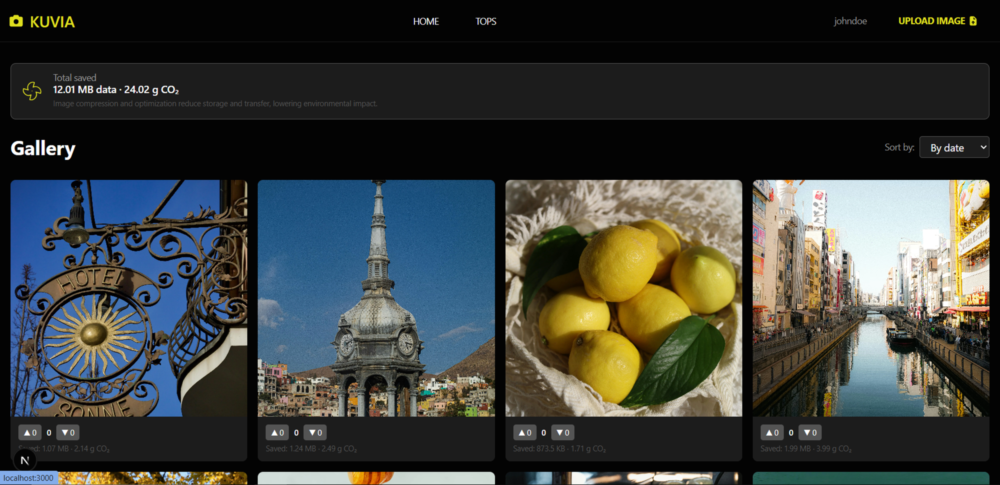
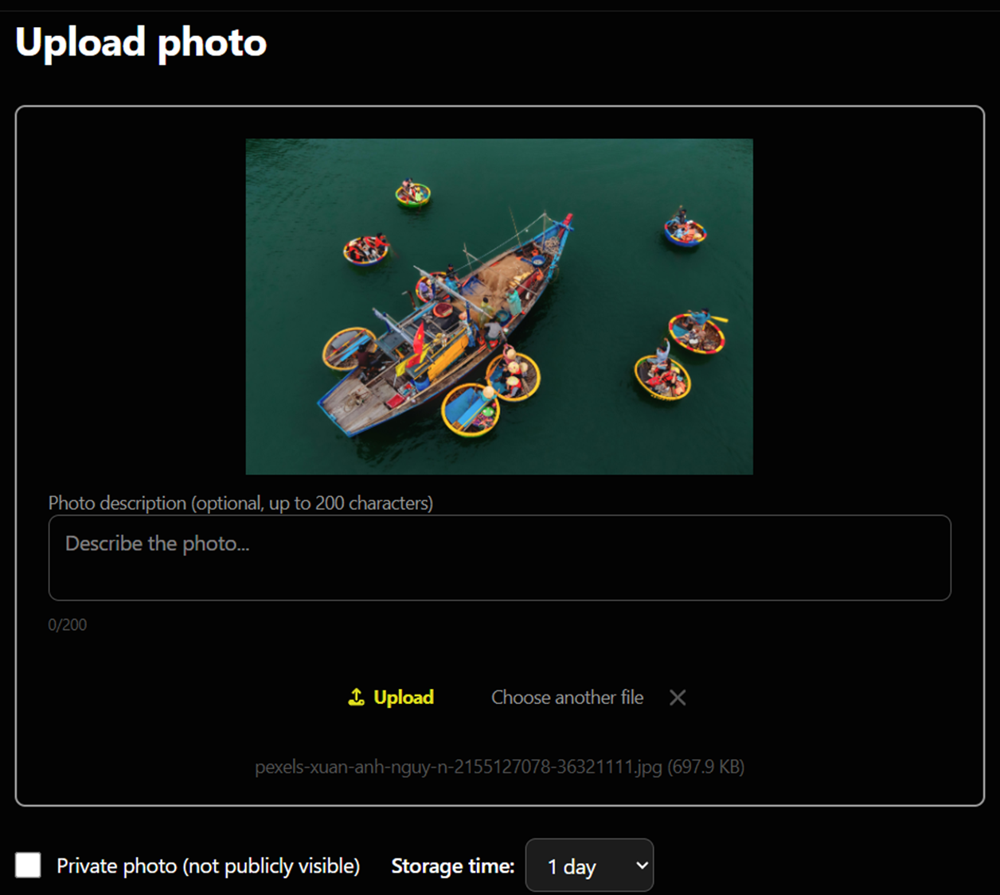
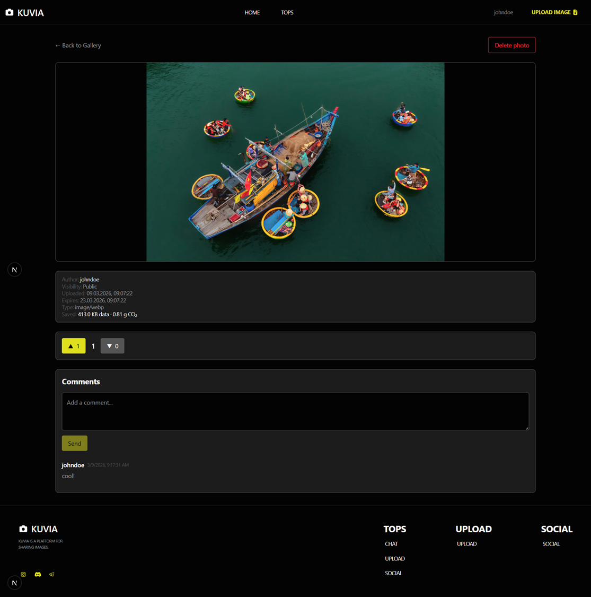
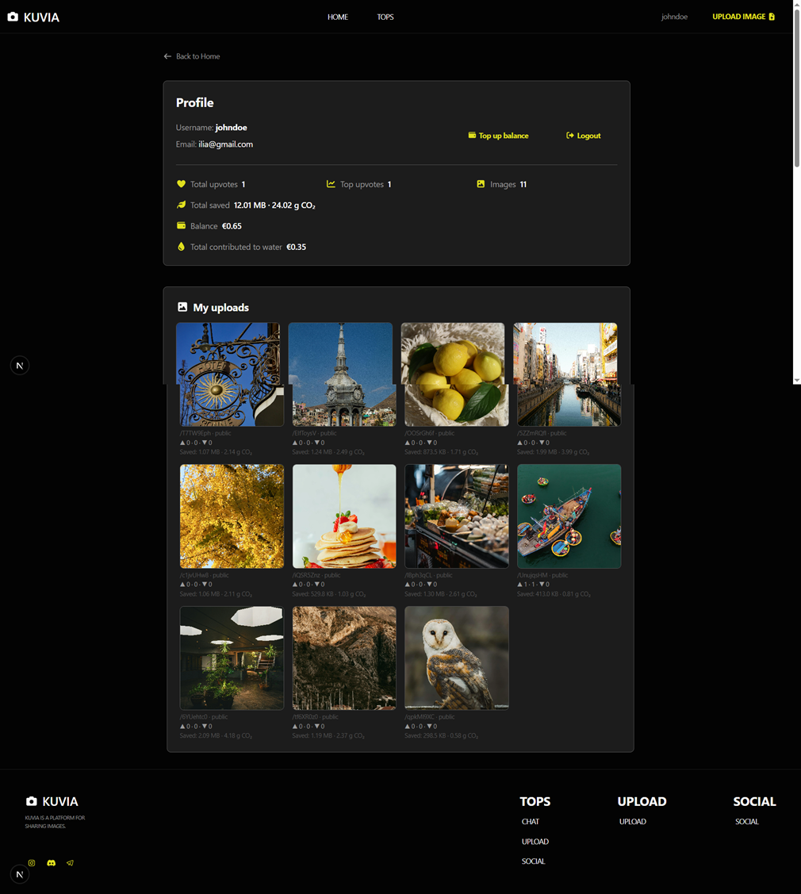

# Kuvia MVP

## Short Project Report

Kuvia is a web application which uses Next.js technology to enable users to share photos in a sustainable way. The platform allows users to upload images and create shareable links while controlling their image display period and tracking their environmental footprint. The MVP includes core functionality for uploading and sharing content together with community features and a back-end API which generates apidoc documentation.

## Application Screenshots









## Published Links

- Front-end: https://sakura-sushi.norwayeast.cloudapp.azure.com/
- Back-end / API: https://sakura-sushi.norwayeast.cloudapp.azure.com/api/images
- API documentation (apidoc): https://sakura-sushi.norwayeast.cloudapp.azure.com/apidoc/index.html

## Database Description

The application uses a MySQL/MariaDB database. The database structure is described in `schema.sql`.

Main tables:

- `users`: user accounts, roles (`user`, `moderator`, `admin`), balance, and total contribution directed to water projects
- `media`: uploaded images, short code, file path, hash, visibility, description, expiration time, and stored size/savings values
- `votes`: upvotes and downvotes for public images
- `comments`: comments on images
- `moderation_log`: log of content removal actions by moderators and administrators

In addition, the schema contains `tags`, `media_tags`, and `views` tables that support future extensibility of the data model.

## Implemented Features

- user registration, login, and logout
- image upload for authenticated users
- file type and file size validation during upload
- image optimization to WebP on upload
- generation of a short shareable link for each image
- ability to set an image as public or private
- storage time selection in the current MVP with options of 1, 7, 14, or 30 days
- duplicate image detection based on file hash within the same user's uploads
- image viewing through a short link with access restriction for private images
- browsing public images in the gallery
- image voting (`upvote` / `downvote`)
- image commenting
- personal profile view with user images, votes, balance, and statistics
- environmental metrics such as saved data size and estimated CO2 reduction
- global environmental statistics for the whole service
- upload limits, paid extra uploads, and balance top-up
- tracking of contributions directed to water projects
- deletion of the user's own images
- moderator and administrator ability to remove content and log the moderation action
- API documentation generation with the `apidoc` tool

## Known Bugs / Limitations

- the balance top-up system presently operates as a testing platform which lacks actual payment system connections
- certain database tables remain hidden because their full user interface functions have not been developed
- the project remains in its MVP development phase which prevents implementation of all features that exist in the initial project documentation

## Development Setup

```bash
npm install
```

```bash
npm run dev
```

```bash
npm run apidoc
```

## Tests

```bash
npm test              # all Jest tests (unit + API)
npm run test:unit     # unit tests (src/lib/__tests__)
npm run test:component # component tests (Vitest)
npm run test:api      # API tests (src/api/__tests__)
```
